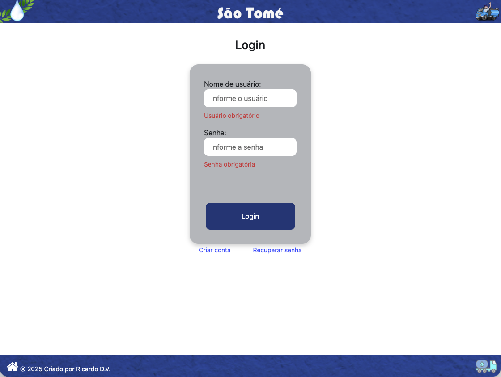
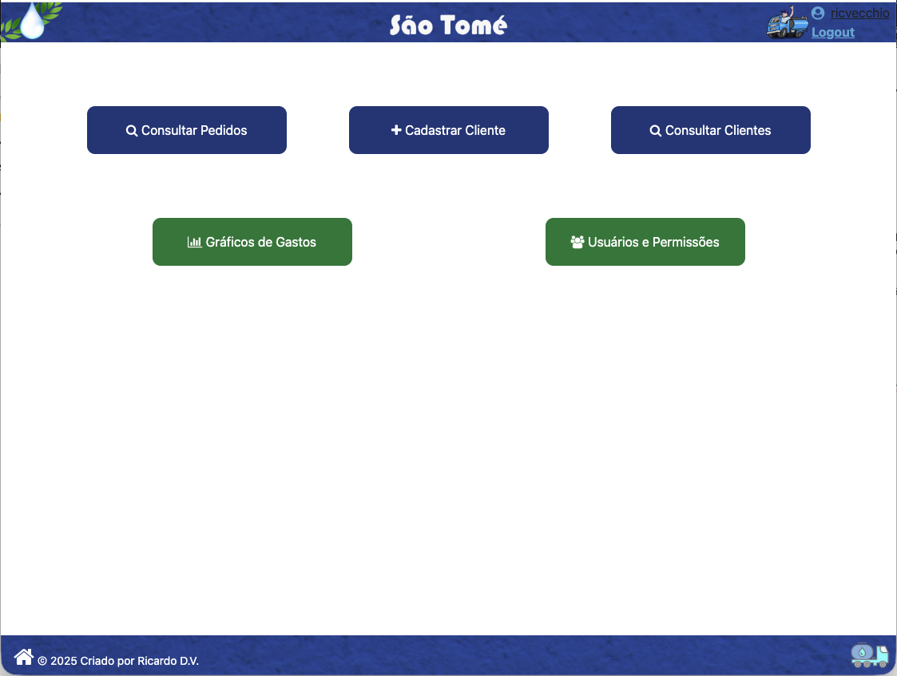
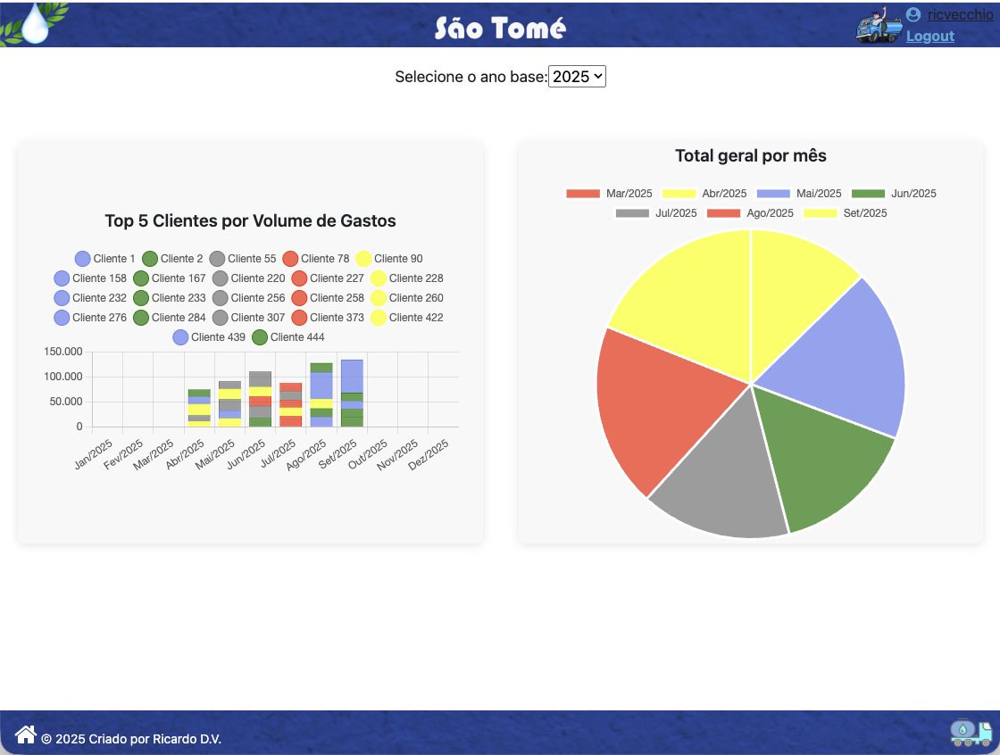

# Frontend Angular - CRUD - Sistema para Gestão de Clientes, Pedidos e Usuários

Este projeto consiste em uma aplicação web desenvolvida em **Angular 19** para o gerenciamento de clientes, pedidos e usuários.
O sistema permite realizar operações CRUD, emitir pedidos com impressão em 2 vias, controlar permissões de acesso, visualizar dashboard analítico e operar em modo offline com sincronização de pedidos quando a conexão voltar.

O objetivo do projeto é centralizar e otimizar o controle comercial, facilitando a análise de dados e a gestão das informações empresariais.

## 🚀 Funcionalidades Principais
- **Autenticação e Sessão:** login, cadastro de novo usuário, recuperação de senha por token e controle de sessão com JWT.
- **Gestão de Clientes:** cadastro, edição, exclusão, consulta paginada, filtro por nome/razão social/CPF-CNPJ e exportação de backup completo para Excel (`.xlsx`).
- **Gestão de Pedidos:** cadastro, edição, exclusão, consulta com filtros (cliente, status e período), impressão e reimpressão de pedidos.
- **Emissão com Imagem:** pedidos emitidos online geram imagem da prévia e permitem impressão em duas vias (A4).
- **Modo Offline (PWA):** login offline, consulta de clientes em cache, emissão de pedidos offline e sincronização automática ao reconectar.
- **Controle de Usuários e Permissões:** listagem, alteração de permissão e exclusão de usuários (tela restrita).
- **Dashboard Analítico:** gráficos (barras e pizza) com top clientes por gasto e total mensal por ano.
- **Exportação de Pedidos:** exportação para Excel (`.xlsx`) com base nos filtros aplicados.
- **Backup de Clientes:** botão "Exportar" na tela de clientes gera arquivo `Backup_Clientes_<timestamp>.xlsx` com todos os campos de todos os clientes, ordenados por ID decrescente (disponível apenas fora do modo offline, para perfis com acesso online).
- **CI/CD e Deploy Automatizado:** workflow no GitHub Actions para build e deploy em VPS via SSH/SCP.

## 🛠 Tecnologias Utilizadas
- Angular 19
- TypeScript
- HTML & CSS
- Angular Material
- Chart.js + ng2-charts
- Dexie (IndexedDB) para persistência offline
- Angular Service Worker (PWA)
- Node.js e NPM

## ⚙️ DevOps / CI/CD
- **GitHub Actions:** pipeline em `.github/workflows/deploy.yml` acionada em push na `main`.
- **Deploy em VPS:** build de produção e publicação dos arquivos em `/home/root/transportadora`.
- **Servidor web:** reinício e limpeza de cache do Nginx após deploy.
- **Firebase Hosting:** configuração presente (`firebase.json`) para hospedagem SPA.

## 📂 Controle de Versão
- Git & GitHub

## 📌 Pré-requisitos
Antes de executar o projeto, certifique-se de ter instalado em sua máquina:
- **Node.js >= 20.x** (versão usada no pipeline de deploy)
- **Angular CLI 19.x**
- **Backend da aplicação em execução:** [transp-api-crud-spring](https://github.com/ricvecchio/transp-api-crud-spring)

## 🚀 Preparar para Produção
Antes de gerar o build final, ajuste e valide estes pontos:
- **API de produção:** confirme o endereço em `src/environments/environment.prod.ts`.
- **Build final:** execute `npm run build` ou `npm run build -- --configuration=production`.
- **Saída gerada:** os arquivos ficam em `dist/transportadora/browser`.
- **Hospedagem SPA:** mantenha rewrite para `index.html` no servidor web.
- **Proxy local:** `proxy.conf.js` deve ser usado apenas no ambiente local com `npm start`.

## 📁 Estrutura do Projeto
- `src/app/clientes` - módulos/telas e serviços de clientes.
- `src/app/pedidos` - módulos/telas e serviços de pedidos.
- `src/app/usuarios` - tela e serviço de usuários/permissões.
- `src/app/dashboard` - tela e serviço de dashboard analítico.
- `src/app/home/login` - login, cadastro e recuperação de senha.
- `src/app/offline` - banco local (IndexedDB) e sincronização offline.
- `src/app/guarda-rotas` - resolvers de rotas para clientes, pedidos e usuários.
- `src/app/modelo` - modelos de dados da aplicação.
- `docs/images` - prints de telas para documentação.

## 🔐 Perfis e Acesso
- Rotas de negócio protegidas por `AuthGuard`.
- Perfil **OFFLINE** possui acesso apenas a rotas permitidas de operação offline.
- Funcionalidades de **Dashboard** e **Usuários/Permissões** ficam visíveis para perfis `ADMIN` e `DESENV` no menu.

## 📶 Funcionalidades Offline
- Banner visual quando o sistema está sem internet.
- Persistência local de clientes em cache e pedidos offline no IndexedDB.
- Emissão de pedido offline com impressão direta e identificador local (`OFF-...`).
- Sincronização automática de pedidos pendentes quando a conexão retorna.
- Existe salvamento de cliente offline pendente no banco local.

## 🖼 Telas do Sistema
### 🔐 Login


### 🏠 Menu Principal


### 📊 Dashboard Analítico


---

👉 Repositório do backend: [transp-api-crud-spring](https://github.com/ricvecchio/transp-api-crud-spring)

---

## ▶️ Como Executar Localmente
```bash
# Clone este repositório
git clone https://github.com/ricvecchio/transp-crud-angular.git

# Acesse a pasta do projeto
cd transp-crud-angular

# Instale as dependências
npm install

# Execute com proxy para o backend local (uso apenas em desenvolvimento)
npm start

# Acesse no navegador
http://localhost:4200
```

## 🧪 Scripts Úteis
```bash
# Desenvolvimento
npm start

# Build de produção
npm run build

# Build de produção explícita
npm run build -- --configuration=production

# Testes unitários
npm test
```

## 🌐 Configuração de Ambiente
- `src/environments/environment.ts` - API local (`http://localhost:8080/api`).
- `src/environments/environment.prod.ts` - API de produção usada no build final.
- `src/environments/environment.local-pwa.ts` - base local para build PWA com comportamento offline.
- `proxy.conf.js` - proxy `/api` exclusivo para o backend local na porta `8080`.
